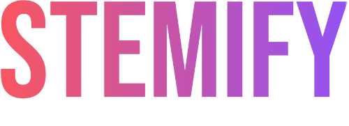

<p align="center">
  
</p>

# Stemify - The Audio Splitter

Un'applicazione web full stack per la separazione delle tracce audio. Questa applicazione permette di caricare un file audio e separarlo nelle sue componenti: voce, batteria, basso e altri strumenti.

## 🚀 Caratteristiche

- Interfaccia web intuitiva
- Separazione delle tracce in tempo reale
- Anteprima audio delle tracce separate
- Download delle singole tracce
- Supporto per vari formati audio

## 📋 Prerequisiti

- Python 3.12 o superiore
- uv (Python package manager) - installalo con: `curl -LsSf https://astral.sh/uv/install.sh | sh`
- npm (Node Package Manager)
- Git

## 💻 Installazione

### Installazione Rapida per Linux e macOS

1. Clona il repository:
```bash
git clone https://github.com/huchukato/stemify-audio-splitter.git
cd stemify-audio-splitter
```

2. Esegui lo script di installazione:
```bash
chmod +x install_and_run.sh
./install_and_run.sh
```

3. Apri il browser e vai a:
```
http://localhost:5173
```

### Installazione Manuale (Per tutti i sistemi operativi)

Se preferisci installare manualmente o stai usando Windows:

#### Backend
```bash
cd demucs-backend
uv sync
uv run gunicorn --bind 0.0.0.0:5001 --workers 1 --timeout 120 app:app  # Su Windows: uv run python app.py
```

#### Frontend
```bash
cd demucs-gui
npm install
npm run dev
```

## 🏗 Struttura del Progetto

```
demucs-gui/
├── demucs-backend/     # Server Flask
│   ├── app.py         # Entry point del backend
│   └── pyproject.toml
├── demucs-gui/        # Client React
│   ├── src/          # Codice sorgente frontend
│   └── package.json
└── install_and_run.sh # Script di installazione
```

## 🔧 Tecnologie Utilizzate

- **Backend**: 
  - Flask (Python)
  - Gunicorn
  - Demucs

- **Frontend**:
  - React
  - TypeScript
  - Vite
  - Tailwind CSS

## 🤝 Contribuire

Le pull request sono benvenute. Per modifiche importanti, apri prima un issue per discutere cosa vorresti cambiare.

## 📝 Licenza

[MIT](https://choosealicense.com/licenses/mit/)

## 👥 Autori

- huchukato 
  - 🐙 [GitHub](https://github.com/huchukato)
  - 🐦 [X (Twitter)](https://twitter.com/huchukato)
  - 🎨 [Civitai](https://civitai.com/user/huchukato) - Check out my AI art models!

## 🙏 Ringraziamenti

- [Facebook Research](https://github.com/facebookresearch/demucs) per Demucs

## 🛡️ Sicurezza

Questo progetto mantiene un forte posture di sicurezza con regolari valutazioni delle vulnerabilità e patch tempestive.

### **Fix di Sicurezza Recenti:**
- ✅ **Marzo 2026**: Risoluzione completa audit di sicurezza
  - Corrette tutte le 15+ vulnerabilità tramite npm audit
  - Aggiornato rollup (CVE-2026-27606), tar (CVE-2026-26960), minimatch (CVE-2026-27903)
  - Risolti tutti gli alert HIGH e MODERATE severity
  - **Stato**: 0 vulnerabilità (npm audit)

### **Pratiche di Sicurezza:**
- 🔍 **Audit Regolari**: Monitoraggio automatico Dependabot
- 🚀 **Aggiornamenti Immediati**: Patch di sicurezza applicate subito
- 📋 **Disclosure Trasparente**: Reporting vulnerabilità trasparente
- 🔒 **Dipendenze Sicure**: Tutti i pacchetti mantenuti aggiornati
